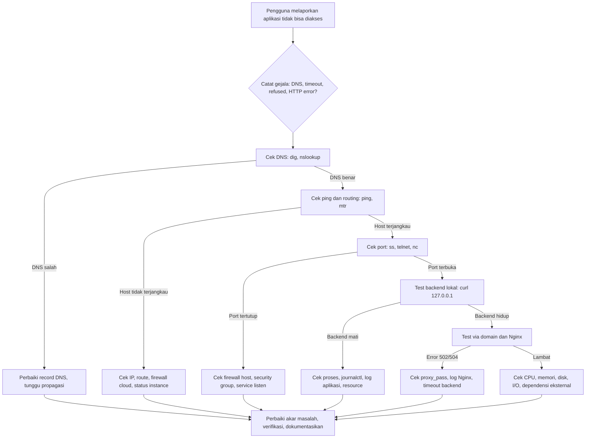

# Cara Troubleshooting Server Linux Ketika Aplikasi Tidak Bisa Diakses

Aplikasi yang tiba-tiba tidak bisa diakses adalah salah satu situasi paling menekan bagi System Engineer. Pengguna melaporkan error, atasan menanyakan estimasi pemulihan, sementara penyebabnya bisa berada di mana saja, mulai dari DNS, firewall, web server, aplikasi itu sendiri, hingga kehabisan resource. Tanpa workflow yang sistematis, troubleshooting mudah berubah menjadi tebakan acak yang membuang waktu dan berisiko memperparah masalah.

Artikel ini membahas workflow troubleshooting yang runtut ketika aplikasi pada server Linux tidak dapat diakses dari jaringan. Pembahasan dimulai dari gejala, pemeriksaan DNS, ping, routing, port, pengujian HTTP, firewall, Nginx, proses aplikasi, log, resource, konektivitas eksternal, hingga flowchart troubleshooting yang dapat dijadikan panduan di lapangan.

## 1. Mulai dari Gejala, Bukan dari Asumsi

Langkah pertama yang paling penting adalah merumuskan gejala secara presisi sebelum menyentuh server. Pertanyaan yang perlu dijawab antara lain apakah semua pengguna terdampak atau hanya sebagian, apakah error berupa timeout, connection refused, DNS error, atau HTTP error seperti 502 dan 503, kapan masalah mulai terjadi, dan apakah ada perubahan terakhir seperti deployment, update, atau perubahan firewall.

Catat pesan error persis seperti yang terlihat oleh pengguna atau monitoring. Perbedaan antara `Could not resolve host`, `Connection timed out`, `Connection refused`, dan `502 Bad Gateway` mengarah ke lapisan yang sangat berbeda. Gejala yang jelas mempersempit area pencarian hingga separuhnya sebelum satu perintah pun dijalankan.

Tentukan juga cakupan masalah. Jika hanya satu pengguna yang terdampak, kemungkinan masalah ada di jaringan atau perangkat pengguna tersebut. Jika semua pengguna tidak bisa mengakses tetapi server masih bisa diakses via SSH dari jaringan internal, kemungkinan masalah ada di reverse proxy, firewall eksternal, atau DNS publik. Jika bahkan SSH pun tidak merespons, fokus pemeriksaan bergeser ke ketersediaan server, jaringan, atau penyedia cloud.

Prinsip selama troubleshooting adalah mengubah satu hal dalam satu waktu, mencatat setiap perubahan, dan selalu memiliki jalan kembali. Hindari me-restart banyak service sekaligus karena akan menghilangkan jejak penyebab asli dan menyulitkan pencegahan di masa depan.

## 2. Memeriksa DNS dan Resolusi Nama

Apabila aplikasi diakses melalui domain, DNS adalah lapisan pertama yang perlu diverifikasi. Kesalahan DNS sering terlihat seperti aplikasi mati, padahal server dan aplikasi dalam kondisi sehat.

Periksa resolusi DNS dari sisi client maupun server:

```bash
nslookup app.contoh.id
dig app.contoh.id +short
dig app.contoh.id +trace
```

Perintah `nslookup` menampilkan hasil resolusi beserta server DNS yang digunakan. Perintah `dig +short` menampilkan jawaban ringkas berupa alamat IP, sehingga mudah dibandingkan dengan IP server yang seharusnya. Perintah `dig +trace` menelusuri rantai resolusi dari root hingga authoritative server, yang berguna untuk memastikan di mana rantai tersebut terputus.

Bandingkan hasil dari resolver berbeda untuk membedakan masalah propagasi dan masalah konfigurasi:

```bash
dig +short app.contoh.id @1.1.1.1
dig +short app.contoh.id @8.8.8.8
getent hosts app.contoh.id
```

Dua perintah pertama memaksa query melalui resolver publik Cloudflare dan Google, sedangkan perintah `getent hosts` memeriksa resolusi melalui konfigurasi sistem lokal termasuk `/etc/hosts` dan NSS. Apabila resolver publik menjawab benar tetapi client tertentu menjawab salah, kemungkinan ada cache lama atau DNS lokal yang belum sinkron.

Jangan lupa memeriksa masa berlaku sertifikat apabila aplikasi menggunakan HTTPS, karena sertifikat kedaluwarsa juga terlihat seperti aplikasi tidak bisa diakses:

```bash
echo | openssl s_client -connect app.contoh.id:443 -servername app.contoh.id 2>/dev/null | openssl x509 -noout -dates
```

Perintah ini membuka koneksi TLS ke port 443, mengambil sertifikat server, lalu menampilkan tanggal mulai dan kedaluwarsa. Opsi `-servername` penting untuk server dengan banyak virtual host agar sertifikat yang dikembalikan sesuai domain yang diminta.

Apabila DNS sudah benar tetapi aplikasi tetap tidak terbuka, lanjutkan ke pemeriksaan jaringan di tingkat IP.

## 3. Memeriksa Konektivitas Dasar dengan Ping dan Routing

Ping berguna untuk memastikan host tujuan dapat dijangkau di tingkat ICMP, sekaligus memberi gambaran awal tentang latency dan packet loss:

```bash
ping -c 4 203.0.113.10
ping -c 4 app.contoh.id
```

Opsi `-c 4` membatasi jumlah paket menjadi empat agar perintah berhenti otomatis. Ping ke alamat IP menguji konektivitas murni tanpa melibatkan DNS, sedangkan ping ke domain menguji kombinasi DNS dan konektivitas. Apabila ping ke IP berhasil tetapi ping ke domain gagal, masalah hampir pasti ada di DNS.

Perlu dipahami bahwa banyak server memblokir ICMP karena kebijakan firewall, sehingga ping gagal belum tentu berarti server mati. Apabila ping diblokir, gunakan pengujian TCP ke port aplikasi sebagai pembanding, yang akan dibahas pada seksi berikutnya.

Untuk melihat jalur yang dilalui paket dan titik di mana paket berhenti:

```bash
traceroute 203.0.113.10
mtr -rzb -c 10 203.0.113.10
```

Perintah `traceroute` menampilkan hop per hop dari client ke server. Perintah `mtr` menggabungkan ping dan traceroute dengan statistik loss dan latency per hop, sedangkan opsi `-r` membuat output dalam mode report, `-z` menampilkan ASN, `-b` menampilkan hostname dan IP, dan `-c 10` mengirim sepuluh paket per hop. Apabila paket berhenti di hop tertentu secara konsisten, informasi tersebut sangat membantu saat berkoordinasi dengan penyedia jaringan atau cloud.

Di sisi server, periksa tabel routing dan interface lokal:

```bash
ip addr show
ip route show
```

Perintah `ip addr show` memastikan interface jaringan memiliki alamat IP yang benar dan berstatus UP, sedangkan `ip route show` memastikan default gateway dan route ke jaringan penting sudah benar. Konfigurasi IP yang hilang setelah reboot atau gateway yang salah adalah penyebab klasik server tidak bisa dihubungi meskipun semua service berjalan.

## 4. Memeriksa Port dan Service yang Listen

Setelah konektivitas IP dipastikan, pertanyaan berikutnya adalah apakah aplikasi benar-benar mendengarkan pada port yang diharapkan. Aplikasi yang crash, gagal start, atau salah bind address akan terlihat hidup dari sisi proses tetapi tidak membuka port ke jaringan.

Periksa port yang sedang listen di server:

```bash
sudo ss -tulpn
sudo ss -tulpn | grep -E '80|443|3000'
```

Perintah `ss -tulpn` menampilkan semua socket TCP dan UDP yang listen beserta proses pemiliknya. Opsi `t` untuk TCP, `u` untuk UDP, `l` untuk listen, `p` untuk nama proses, dan `n` untuk menonaktifkan resolusi nama. Perintah kedua menyaring output untuk port web umum dan port aplikasi contoh. Perhatikan kolom alamat bind. Apabila aplikasi hanya bind ke `127.0.0.1:3000`, maka ia hanya dapat diakses dari server itu sendiri dan membutuhkan reverse proxy untuk akses eksternal. Apabila seharusnya bind ke `0.0.0.0` tetapi tidak muncul sama sekali, kemungkinan aplikasi belum berjalan.

Uji konektivitas TCP dari client atau dari server lain:

```bash
telnet 203.0.113.10 80
nc -vz 203.0.113.10 443
```

Perintah `telnet` mencoba membuka koneksi TCP interaktif ke port 80, sedangkan `nc -vz` melakukan pemindaian cepat dengan output verbose tanpa mengirim data. Hasil `succeeded` atau `open` berarti port dapat dijangkau, sedangkan `refused` berarti paket sampai ke host tetapi tidak ada service yang menerima, dan `timed out` berarti paket kemungkinan dihalangi firewall di tengah jalan.

Untuk pengujian yang lebih modern dan informatif, `curl` dapat menampilkan waktu tiap tahap koneksi:

```bash
curl -v http://203.0.113.10/
curl -o /dev/null -s -w "connect:%{time_connect} starttransfer:%{time_starttransfer} total:%{time_total} code:%{http_code}\n" http://203.0.113.10/
```

Perintah pertama menampilkan detail koneksi, request, dan respons secara verbose. Perintah kedua menampilkan ringkasan waktu koneksi, waktu hingga byte pertama, total waktu, dan HTTP status code. Apabila `time_connect` besar, masalah ada di jaringan. Apabila `time_starttransfer` besar, kemungkinan backend lambat memproses request.

## 5. Pengujian HTTP Langsung ke Backend dan via Domain

Langkah berikutnya adalah memisahkan masalah lapisan proxy dan lapisan aplikasi dengan menguji keduanya secara terpisah. Uji backend langsung dari server menggunakan alamat loopback:

```bash
curl -v http://127.0.0.1:3000/health
curl -i http://127.0.0.1:3000/
```

Endpoint `/health` pada contoh di atas mewakili health check yang idealnya disediakan setiap aplikasi. Respons 200 berarti aplikasi hidup dan mampu melayani request. Opsi `-i` menampilkan header respons beserta body, sehingga status code dan tipe konten dapat diverifikasi langsung.

Kemudian uji akses melalui domain dan melalui Nginx:

```bash
curl -v http://app.contoh.id/
curl -k -v https://app.contoh.id/
curl -H "Host: app.contoh.id" -v http://203.0.113.10/
```

Perintah pertama menguji jalur normal melalui DNS dan reverse proxy. Perintah kedua menguji HTTPS dengan opsi `-k` untuk melewati validasi sertifikat sementara saat diagnosis, yang berguna untuk membedakan masalah sertifikat dan masalah routing. Perintah ketiga memaksa header Host tertentu saat mengakses langsung via IP, sehingga dapat dipastikan apakah blok `server_name` Nginx sudah menangani domain tersebut.

Interpretasi hasilnya cukup jelas. Apabila backend lokal merespons tetapi akses via domain gagal, fokuskan pemeriksaan ke Nginx, firewall, atau DNS. Apabila backend lokal saja sudah gagal, fokuskan pemeriksaan ke proses aplikasi dan log-nya, karena memperbaiki Nginx tidak akan membantu selama backend masih mati.

## 6. Memeriksa Firewall dan Security Group

Firewall yang terlalu ketat adalah penyebab umum aplikasi tidak bisa diakses meskipun service berjalan sempurna. Pemeriksaan perlu dilakukan berlapis, dari firewall host hingga security group cloud.

Periksa firewall host pada Ubuntu:

```bash
sudo ufw status verbose
sudo iptables -L -n -v | head -n 50
```

Perintah pertama menampilkan aturan `ufw` beserta kebijakan bawaan dan port yang diizinkan. Perintah kedua menampilkan aturan `iptables` mentah untuk memastikan tidak ada aturan manual yang bertentangan dengan `ufw`. Pastikan port 80 dan 443 terbuka untuk akses web, serta port SSH tidak tertutup secara tidak sengaja saat eksperimen aturan.

Pada sistem RHEL, gunakan perintah berikut:

```bash
sudo firewall-cmd --list-all
```

Perintah ini menampilkan zona aktif, service yang diizinkan, dan port yang dibuka. Apabila aplikasi berjalan di port kustom seperti 3000 dan diakses langsung tanpa reverse proxy, port tersebut harus dibuka eksplisit atau diakses melalui proxy yang port-nya sudah terbuka.

Jangan lupa lapisan security group di cloud. Verifikasi di konsol penyedia bahwa security group instance mengizinkan traffic dari internet ke port yang dibutuhkan, dan bahwa network ACL di level subnet tidak menolaknya. Kasus yang sering terjadi adalah aturan `ufw` sudah benar tetapi security group masih menolak, atau sebaliknya. Kedua lapisan harus selaras agar traffic dapat lewat.

Untuk memastikan apakah paket sampai ke server, periksa log firewall atau lakukan pengujian sementara dari IP tepercaya. Hindari menonaktifkan firewall sepenuhnya di production sebagai jalan pintas, karena membuka risiko keamanan yang jauh lebih besar daripada masalah awalnya.

## 7. Memeriksa Nginx dan Reverse Proxy

Apabila aplikasi berada di belakang Nginx, konfigurasi proxy adalah titik pemeriksaan berikutnya. Mulailah dari validitas sintaks dan status service:

```bash
sudo nginx -t
sudo systemctl status nginx
```

Perintah `nginx -t` menguji sintaks konfigurasi tanpa me-restart service. Apabila ada kesalahan ketik atau file yang hilang, perintah ini akan menunjukkannya sebelum service di-reload. Perintah `status` memastikan Nginx berjalan dan tidak gagal start setelah perubahan terakhir.

Periksa blok server dan proxy yang relevan:

```bash
sudo nginx -T | grep -A 20 "server_name app.contoh.id"
cat /etc/nginx/sites-enabled/aplikasi.conf
```

Perintah `nginx -T` menampilkan seluruh konfigurasi efektif hasil gabungan include, sehingga berguna untuk memastikan file yang diedit benar-benar terbaca. Opsi `grep` menyaring bagian domain yang bermasalah. Pastikan `proxy_pass` mengarah ke alamat dan port backend yang benar, misalnya `http://127.0.0.1:3000`, bukan port lama yang sudah tidak digunakan setelah deployment baru.

Periksa log error Nginx untuk petunjuk langsung:

```bash
sudo tail -n 100 /var/log/nginx/error.log
sudo tail -n 100 /var/log/nginx/app-error.log
```

Pesan `connect() failed (111: Connection refused)` berarti backend tidak mendengarkan. Pesan `upstream timed out` berarti backend terlalu lambat atau deadlock. Pesan `no live upstreams` pada setup load balancing berarti semua backend dianggap mati oleh health check. Setiap pesan ini mengarah ke tindakan berbeda, sehingga membaca log jauh lebih efektif daripada menebak.

## 8. Memeriksa Proses Aplikasi dan Log-nya

Apabila backend tidak merespons, periksa apakah proses aplikasi benar-benar berjalan:

```bash
ps aux | grep -E "node|php|python|java" | grep -v grep
sudo systemctl status aplikasi
sudo journalctl -u aplikasi -n 100 --no-pager
```

Perintah pertama mencari proses aplikasi berdasarkan nama runtime. Perintah kedua memeriksa status service systemd, termasuk apakah service aktif, gagal, atau restart berulang. Perintah ketiga menampilkan seratus baris log terakhir service tersebut, tempat biasanya tercatat error startup, kegagalan koneksi database, atau kehabisan memori.

Periksa juga log aplikasi di direktori khusus apabila tersedia:

```bash
sudo tail -n 200 /var/log/aplikasi/app.log
sudo tail -n 200 /var/log/php-fpm/error.log
```

Pola error yang umum antara lain aplikasi gagal bind karena port sudah dipakai proses lain, koneksi database ditolak karena kredensial atau firewall, kehabisan file descriptor, atau crash akibat unhandled exception setelah deployment baru. Apabila service restart berulang dalam waktu singkat, jangan sekadar me-restart manual berkali-kali, tetapi cari akar masalah di log karena restart tanpa perbaikan hanya mengulang kegagalan yang sama.

Untuk aplikasi yang dikelola process manager atau container, sesuaikan perintah pemeriksaan dengan tools-nya, misalnya `pm2 status`, `docker ps`, atau `kubectl get pods`, tetapi prinsipnya tetap sama, yaitu pastikan proses hidup, baca log-nya, dan pahami mengapa ia berhenti atau tidak merespons.

## 9. Memeriksa Resource Sistem

Aplikasi yang sehat secara logika tetap bisa tidak merespons apabila server kehabisan CPU, memori, disk, atau kehabisan inode. Pemeriksaan resource sebaiknya dilakukan cukup awal karena cepat dan sering kali langsung menunjukkan penyebabnya.

```bash
uptime
free -h
df -h
df -i
```

Perintah `uptime` menampilkan load average satu, lima, dan lima belas menit terakhir. Nilai load yang jauh lebih besar dari jumlah CPU mengindikasikan antrean proses yang berat. Perintah `free -h` menampilkan penggunaan memori dan swap. Penggunaan swap yang tinggi menandakan tekanan memori serius. Perintah `df -h` menampilkan ruang disk, sedangkan `df -i` menampilkan penggunaan inode. Disk yang penuh atau inode yang habis dapat membuat aplikasi gagal menulis log, session, atau file sementara, lalu berhenti merespons dengan cara yang membingungkan.

Periksa proses paling boros resource:

```bash
top -b -n 1 | head -n 30
ps aux --sort=-%cpu | head -n 15
ps aux --sort=-%mem | head -n 15
```

Perintah pertama mengambil satu snapshot `top` dalam mode batch. Dua perintah berikutnya mengurutkan proses berdasarkan CPU dan memori. Apabila ditemukan proses yang memakan hampir seluruh resource, tentukan apakah itu perilaku normal saat beban puncak atau anomali seperti memory leak dan query database yang tidak selesai.

Periksa juga tekanan I/O disk yang sering luput dari perhatian:

```bash
iostat -x 1 3
sudo dmesg | tail -n 50
```

Utilisasi disk mendekati seratus persen pada `iostat` menjelaskan mengapa aplikasi lambat meskipun CPU dan memori terlihat longgar. Output `dmesg` dapat mengungkap error kernel seperti disk failing, OOM killer yang mematikan proses aplikasi, atau masalah filesystem yang membutuhkan perbaikan.

## 10. Konektivitas Keluar dan Dependensi Eksternal

Tidak semua kegagalan berasal dari traffic masuk. Banyak aplikasi modern bergantung pada konektivitas keluar ke database managed, API pihak ketiga, atau repository paket. Apabila dependensi eksternal tidak dapat dihubungi, aplikasi dapat timeout dan terlihat mati dari sisi pengguna.

Uji konektivitas keluar dari server:

```bash
ping -c 3 8.8.8.8
curl -I https://api.pihakketiga.id/health
telnet db.internal 5432
```

Ping ke DNS publik menguji konektivitas internet dasar. Perintah `curl` menguji akses HTTPS ke API eksternal. Perintah `telnet` ke port database menguji konektivitas ke database internal. Apabila koneksi keluar gagal tetapi koneksi masuk normal, periksa default gateway, aturan firewall outbound, security group egress, dan konfigurasi proxy HTTP apabila server diharuskan melewati proxy untuk akses internet.

Periksa juga resolusi DNS dari sisi server, karena server yang tidak bisa me-resolve nama database atau API akan mengalami kegagalan yang mirip dengan aplikasi crash:

```bash
cat /etc/resolv.conf
nslookup db.internal
```

Berkas `/etc/resolv.conf` menunjukkan DNS resolver yang digunakan server. Apabila resolver salah setelah perubahan jaringan, semua dependensi berbasis hostname akan ikut gagal meskipun alamat IP-nya sehat.

## 11. Flowchart Troubleshooting Sistematis

Agar workflow di atas mudah diikuti saat insiden, berikut alur troubleshooting dalam bentuk diagram Mermaid yang dapat ditempel ke dokumentasi internal. Diagram ini memaksa engineer memeriksa lapisan demi lapisan dari luar ke dalam, bukan melompat acak.



Apabila diagram Mermaid belum didukung oleh platform dokumentasi yang digunakan, versi langkah ASCII berikut dapat digunakan sebagai checklist berurutan:

```text
1. Catat gejala dan cakupan dampak
2. Verifikasi DNS dan sertifikat
3. Verifikasi ping dan routing
4. Verifikasi port listen dan konektivitas TCP
5. Uji backend lokal via loopback
6. Uji via domain dan reverse proxy
7. Periksa firewall host dan security group
8. Periksa Nginx dan proxy_pass
9. Periksa proses aplikasi dan log
10. Periksa CPU, memori, disk, inode, I/O
11. Periksa konektivitas keluar dan dependensi
12. Perbaiki satu hal, verifikasi, dokumentasikan
```

Kedua format di atas menyampaikan prinsip yang sama, yaitu bergerak dari gejala ke lapisan terluar, lalu masuk semakin dalam hingga ke aplikasi dan resource. Setelah masalah pulih, tambahkan langkah pasca-insiden berupa dokumentasi temuan, perbaikan monitoring agar masalah serupa terdeteksi lebih awal, dan otomatisasi pemeriksaan yang masih manual.

## Kesimpulan

Troubleshooting aplikasi yang tidak bisa diakses pada server Linux menjadi jauh lebih tenang ketika dilakukan berlapis dan berbasis bukti. Mulailah dari gejala yang presisi, verifikasi DNS, konektivitas, port, backend lokal, proxy, firewall, log aplikasi, resource sistem, dan dependensi eksternal secara berurutan. Setiap perintah dalam artikel ini memiliki peran spesifik untuk menjawab satu pertanyaan diagnosis, bukan sekadar dijalankan karena kebiasaan. Dengan workflow dan flowchart di atas, waktu pemulihan dapat dipersingkat, akar masalah lebih mudah ditemukan, dan hasil pembelajaran dari setiap insiden dapat diubah menjadi monitoring serta dokumentasi yang mencegah kejadian serupa terulang.

